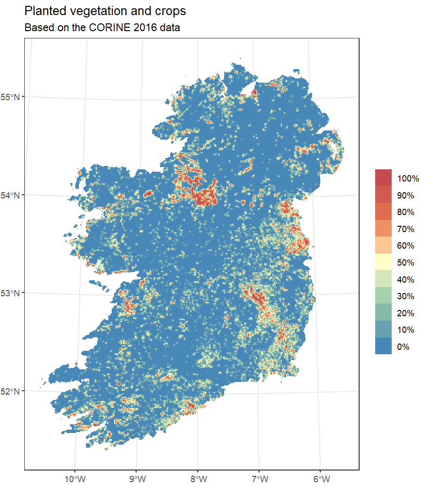
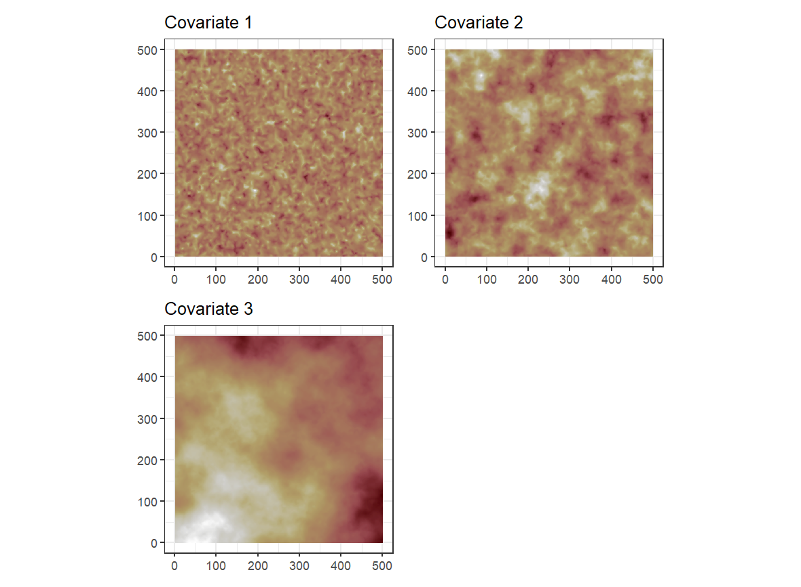
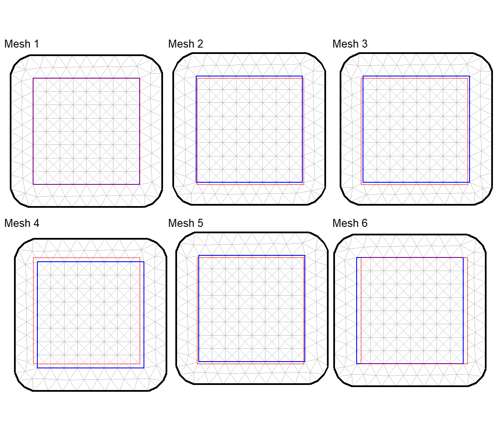
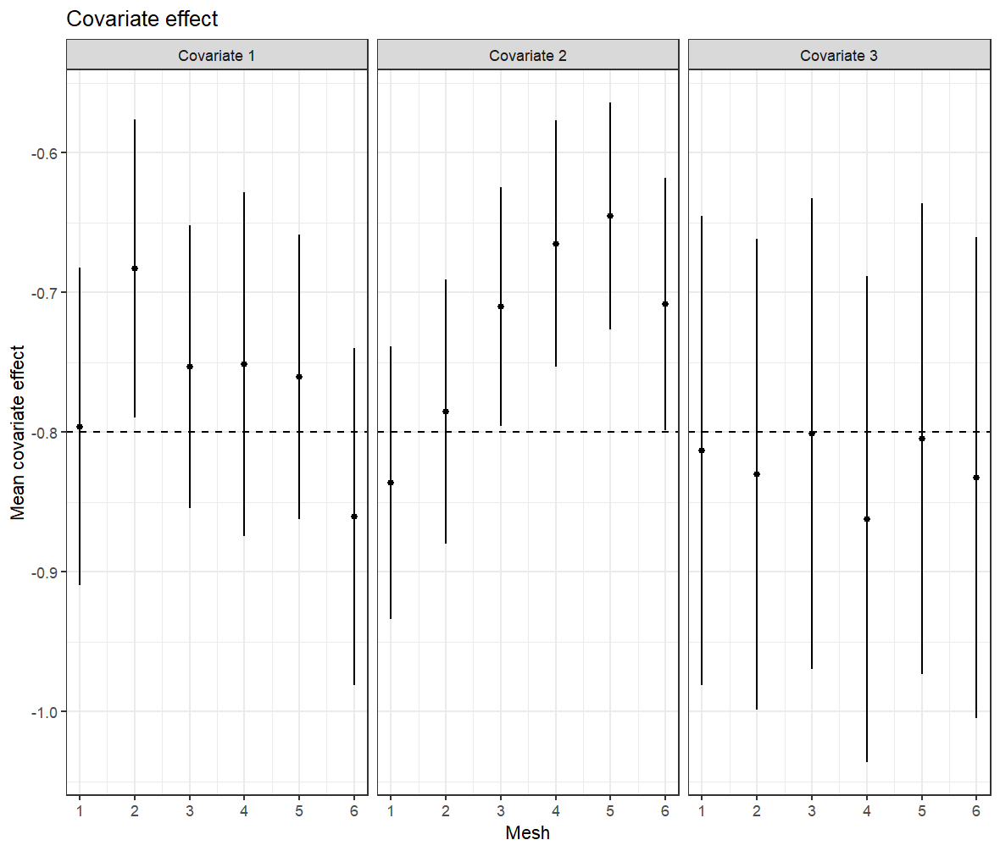

```{r setup, include=FALSE}
knitr::opts_chunk$set(echo = FALSE,
                      warning = FALSE,
                      tidy = FALSE,
                      message = FALSE,
                      fig.align = 'center',
                      out.width = "100%")
options(knitr.table.format = "html") 
#options(knitr.graphics.error = FALSE)

```

# Rationale

In ecology, spatial point processes (SPP) are a statistical methodology
that are becoming increasingly popular through their implementation
using INLA/SPDE as an inference technique. Key to this approach is the
representation of a spatially continuous Gaussian random field, defined
over a triangular mesh spanning the spatial domain. Crucial to model
implementation is the choice of spatial information (covariates). The
resolution and scale of these needs to be taken into account when
designing the mesh and associated integration scheme.

# Main problem

The Gaussian random field and spatial covariates are evaluated at the
same locations, the integration points, across the spatial domain. As
SPP are models continuous in space, the continuity of the spatial
covariate and spatial random effect are approximated by interpolation
between integration points. Therefore, the model will only *see* the
spatial covariates at these defined integration points. If a covariate
*actually* has a range much smaller than the distance between
integration points, the model will fail to provide reliable inference.

{width="1150"}

<font size="6.5"> **Figure 1**: In environmental variables with very
short range like the one pictured below, the values change from 100 to 0
in very short distances. If the resolution of the integration points is
not small enough to capture this short range, the model will struggle to
infer the effect of the covariate, and the coefficients produced will be
unreliable </font>

# An example

Let's picture three covariates with very different ranges:

{width="1100"}

<font size="6.5"> **Figure 2**: Three covariates randomly generated.
Covariate 1 has a range of 10, Covariate 2 has a range of 50, and
covariate 3 has a range of 600 </font>

Now, let's fit a SPP model to those covariates with 6 slightly varying
meshes. The only variation is that the domain of the mesh is slightly
shifted in space for each of them. This will cause slightly shifted
integration points for each, as these points are located at the vertices
of the mesh triangles.

{width="1100"}

<font size="6.5"> **Figure 3**: This six meshes have been created with
exaclty the same parameter, except that the iner boundary is shifted in
space a little bit for each of them. That makes the integration points
that are the vertices of the triangles shift a little too </font>

After fitting one model with each mesh to the same point pattern, we can
see how the coefficients vary much more for the covariate with the
shortest range (Covariate 1), whereas the coefficients for the covariate
with the longest range (Covariate 3) are much more stable

$$
log(\lambda(s)) = \beta_{0} + \beta_{1}Covariate
$$

{width="1100"}

<font size="6.5"> **Figure 4**: This six meshes have been created with
exaclty the same parameter, except that the iner boundary is shifted in
space a little bit for each of them. That makes the integration points
that are the vertices of the triangles shift a little too. </font>

# Conclusions

Using both simulations and real-world ecological data, we illustrate
these challenges and offer guidelines to empower users in navigating
these complexities and mitigating potential pitfalls when using these
methods in ecological applications such as species distribution models
based on presence-only data.
